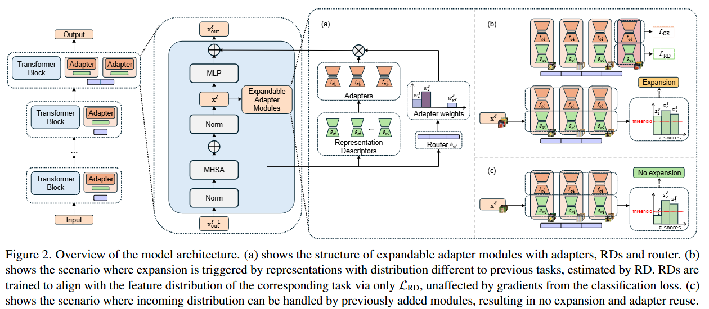
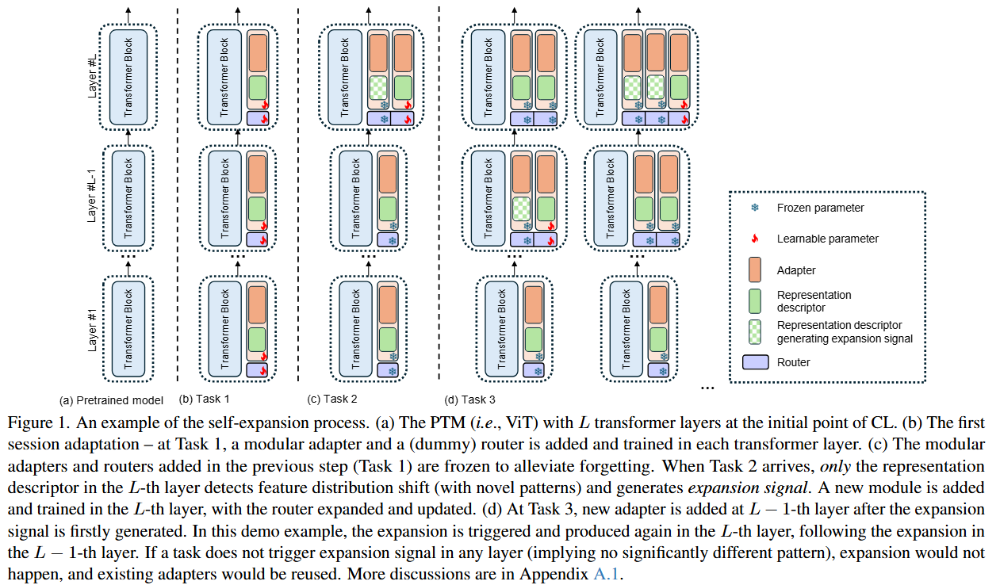

# Self-Expansion of Pre-trained Models with Mixture of Adapters for Continual Learning


This is the official implementation of 

Self-Expansion of Pre-trained Models with Mixture of Adapters for Continual Learning 

[Huiyi Wang](https://huiyiwang01.github.io/), [Haodong Lu](https://jeff024.github.io/), [Lina Yao](https://www.linayao.com/), [Dong Gong](https://donggong1.github.io/) 


In CVPR 2025.

<p>
  <a href="https://cvpr.thecvf.com/virtual/2025/poster/32576"></a>
  <a href='https://arxiv.org/abs/2403.18886'></a>
  <a href=""></a>
</p>

## Abstract
Continual learning (CL) aims to continually accumulate knowledge from a non-stationary data stream without catastrophic forgetting of learned knowledge, requiring a balance between stability and adaptability. Relying on the generalizable representation in pre-trained models (PTMs), PTM-based CL methods perform effective continual adaptation on downstream tasks by adding learnable adapters or prompts upon the frozen PTMs. However, many existing PTM-based CL methods use restricted adaptation on a fixed set of these modules to avoid forgetting, suffering from limited CL ability. Periodically adding task-specific modules results in linear model growth rate and impaired knowledge reuse. We propose **S**elf-**E**xpansion of pre-trained models with **M**odularized **A**daptation (SEMA), a novel approach to enhance the control of stability-plasticity balance in PTM-based CL. SEMA automatically decides to reuse or add adapter modules on demand in CL, depending on whether significant distribution shift that cannot be handled is detected at different representation levels. 
We design modular adapter consisting of a functional adapter and a representation descriptor. The representation descriptors are trained as a distribution shift indicator and used to trigger self-expansion signals. For better composing the adapters, an expandable weighting router is learned jointly for mixture of adapter outputs. SEMA enables better knowledge reuse and sub-linear expansion rate. Extensive experiments demonstrate the effectiveness of the proposed self-expansion method, achieving state-of-the-art performance compared to PTM-based CL methods without memory rehearsal.

## Method
### Overview of SEMA

### Example of the self-expansion process



## Requirements
### Building environment
```
conda env create -f sema_env.yaml
```

### Datasets
The datasets can be downloaded from the sources provided in [PILOT](https://github.com/sun-hailong/LAMDA-PILOT).

- **CIFAR100**: will be automatically downloaded by the code.
- **ImageNet-R**: Google Drive: [link](https://drive.google.com/file/d/1SG4TbiL8_DooekztyCVK8mPmfhMo8fkR/view?usp=sharing) or Onedrive: [link](https://entuedu-my.sharepoint.com/:u:/g/personal/n2207876b_e_ntu_edu_sg/EU4jyLL29CtBsZkB6y-JSbgBzWF5YHhBAUz1Qw8qM2954A?e=hlWpNW)
- **ImageNet-A**:Google Drive: [link](https://drive.google.com/file/d/19l52ua_vvTtttgVRziCZJjal0TPE9f2p/view?usp=sharing) or Onedrive: [link](https://entuedu-my.sharepoint.com/:u:/g/personal/n2207876b_e_ntu_edu_sg/ERYi36eg9b1KkfEplgFTW3gBg1otwWwkQPSml0igWBC46A?e=NiTUkL)
- **VTAB**: Google Drive: [link](https://drive.google.com/file/d/1xUiwlnx4k0oDhYi26KL5KwrCAya-mvJ_/view?usp=sharing) or Onedrive: [link](https://entuedu-my.sharepoint.com/:u:/g/personal/n2207876b_e_ntu_edu_sg/EQyTP1nOIH5PrfhXtpPgKQ8BlEFW2Erda1t7Kdi3Al-ePw?e=Yt4RnV)

## How to Run
```
python3 main.py --config exps/[config_name].json
```

## Acknowledgement
Some components of this repo are based on [PILOT](https://github.com/sun-hailong/LAMDA-PILOT) and [AdaptFormer](https://github.com/ShoufaChen/AdaptFormer). We thank the authors for open-sourcing their code.

## Citation
If you find our work useful in your research, please consider citing:

```
@inproceedings{SEMA,
    author={Wang, Huiyi and Lu, Haodong and Yao, Lina and Gong, Dong},
    title={Self-Expansion of Pre-trained Models with Mixture of Adapters for Continual Learning},
    booktitle={Proceedings of the IEEE/CVF Conference on Computer Vision and Pattern Recognition (CVPR)},
    year={2025}
}
```
